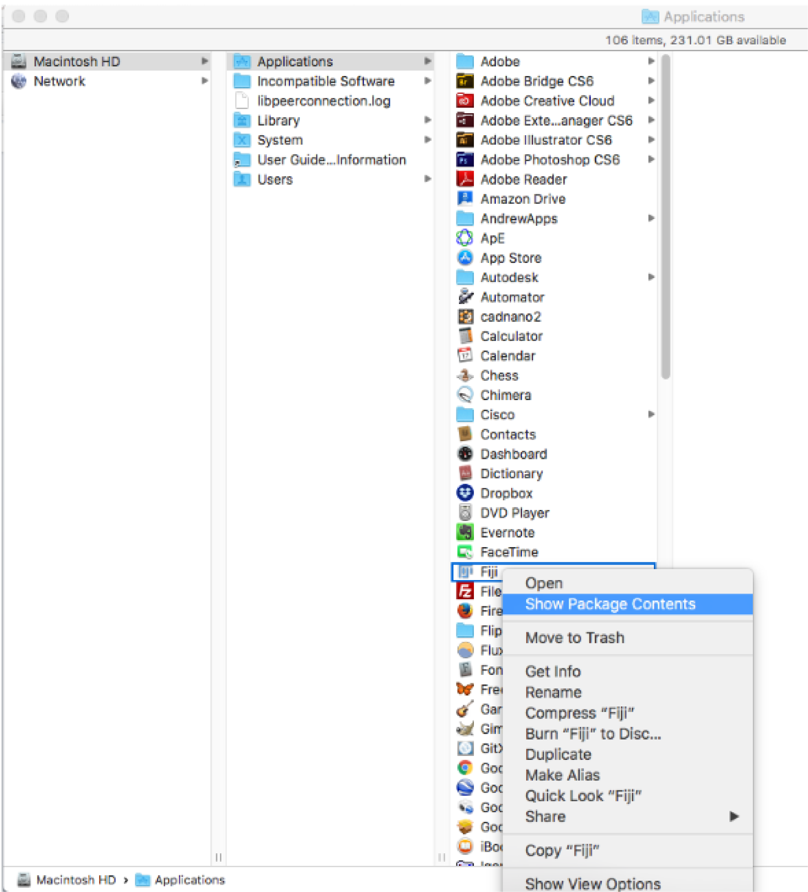

Jimbob
======

**Jimbob** is a plugin for Micromanager designed to allow uses to get real time feedback on how data will look when converted to traces. It is a lightweight version of the JIM generate traces pipeline, which cuts a lot of corners to speed up processing considerably. On most data, the output of Jimbob will be nearly identical to the full JIM, however there are limitations to its usage.

Jimbob Limitations
------------------

**No Image Tranformation** Jimbob assumes images are already correctly orientated. 

**No Image Alignment** Jimbob designed for data collected using sequential acquisition

Installing Jimbob
-----------------

To run Jimbob in micromanager, copy **Jimbob.jar** from the Jimbob folder and paste it into the **mmplugins** folder, located in your micromanager installation folder. By default, this folder location is C:\Program Files\Micro-Manager-2.0\mmplugins

**WARNING** Do NOT put it in the **plugins** folder, make sure it is the **mmplugins** folder.

