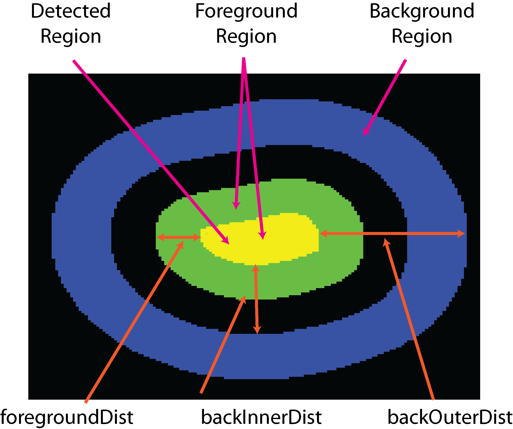

**************************
Generate Traces Parameters
**************************

"Generate Traces" is a high level pipeline that uses a combination JIM programs to transform raw microscopy images into fluorescent intensity traces. Traces plot the fluorescent intensity of an analyzed particle minus the background intensity in each frame of the experiment

On this page, we explain the parameters and options for each step of this pipeline.

File selection
==============
The first step in generating traces is to select a .TIFF stack of raw microscopy data that needs to be analysed. 
JIM adheres to the `OME TIFF standard <https://docs.openmicroscopy.org/ome-model/5.6.3/ome-tiff>`_ , and is predominantly used on data collected using `Micromanager <https://https://micro-manager.org/>`_.
Running this section will create a folder in the same directory as the tiff stack with the same name as the tiff stack. The results of all analysis will be saved in this folder.

**Additional Extensions to Remove** - *additionalExtensionsToRemove* : By default, JIM just removes the ".tiff" extension from the end a of file and creates a folder of that name. Tiffs that adhere to the ome standard often end in .ome.tiff. This parameter allows you to remove the extra .ome from working folder name if you want to by setting it to 1. Alternatively, files with even more extensions can be removes by using larger numbers.

**Multiple Files Per Image Stack** - *multipleFilesPerImageStack* -  : Micromanager outputs as 32 bit Tiffs, which limits file sizes to 4 Gbs. Datasets that are larger than this are split over multiple files. Enable this if you're stack is split over multiple tiff files (i.e. >4Gb)

Organise Channels
=================
This section combines multi-file tiffs into a single big-tiff and splits a multi-channel tiff stack into individual files for each channel to make it easier for downstream processing.

**Number of Channels** - *imStackNumberOfChannels* : Set this value to the number of channels in the data.

**Disable Metadata** - *imStackDisableMetadata* : The program is able to read ome metadata to ensure images stacks are split correctly even if they are not saved in order. This can be disabled if this causes problems. If a metadata file is not used, this program assumes that images are saved in alternating order. For example, in a two channel imagestack, the first image will correspond to frame 1 from channel 1 then the second image will be frame 1 from channel 2 followed by frame 2 from channel 1 etc. As a result, it is important to make sure that files are saved in the correct order or they will not split correctly.

**Stack Start Frame** - *imStackStartFrame* : Part of the image stack can be completely ignored for all downstream analysis. This is helpful if there is a delay at the start of the experiment. Set this to 1 to start from the first frame. Note that all downstream programs will treat the first frame set here as frame number 1.

**Stack End Frame** - *imStackEndFrame* : Last frame to take. Negative numbers go from the end of the stack, so set to -1 to take the entire stack. This is helpful if something goes wrong with at the end of the experiment but you still want to use the initial section.

Channel Transformation
----------------------
If images were captured using a multi-camera microscope, one of the cameras will record images reflected off a dichroic mirror that separates the emitted signals. The splitting of the light by this mirror can cause image from one channel to be inverted relative to the other. Micromanager (and almost all other acquisition software) have an on the fly processing module to ensure that images are saved with all channels with matching orientations. However, the on-the-fly invert correction process can be computationally intensive when imaging from  cameras that produce large images and/or acquired at very high frame rates. The following variables allows the user to correct the images stack so they (at least roughly) overlay. 

**Channels to Transform** - *imStackChannelsToTransform* : If no channels need to be transformed let this parameter empty (channelsToTransform = ''), otherwise set this to the channel numbers that need to be transformed separated by spaces. eg. '2 3' for channels 2 and 3;

**Vertical Flip** - *imStackVerticalFlipChannel* : For each channel to be transformed put 1 to flip that channel vertically or 0 to not. eg. '1 0' to flip channel 2 but not 3.

**Horizontal Flip** - *imStackHorizontalFlipChannel* : Same as vertical but for horizontally flipping.

**Rotate** - *imStackRotateChannel* : For each channel to be transformed, put a value to rotate it. Rotation values should be 0, 90 180 or 270 degree. eg. '0 270' to leave channel 2 as is and rotate channel 3 by 270 degrees.

Align Channels and Calculate Drifts
===================================
Drift correction of microscopy imaging is required to counter stage movement during image acquisition. During image acquisition, the microscope stage will inevitably move due to a number of factors including thermal fluctuations, airflow over the microscope and vibrations. By correcting for these shifts, we ensure that the fluorescent intensity of the same area is being measured throughout the experiment.

Similarly, if multi-channel data has been collected on a microscope with multiple cameras or using an optosplit, the different channels may not overlay with each other perfectly. By measuring the shift between channels we can measure the same relative area in every channel.  

This section consists of two parts: The first part calculates the drift correction for the image stack, while the second half calculates the alignment between channels.

**Iterations** - *alignIterations* : Number of times to iterate drift correction calculations, 1 is fine if there minimal drift in the reference frames, or there is strong signal in the reference frames

**Alignment Start Frame** - *alignStartFrame* :  Select reference frames where there is signal in all channels at the same time. Frames start from 1

**Alignment End Frame** - *alignEndFrame* : Last frame reference frames where there is signal in all channels. Negative numbers go from the end of the stack, so set to -1 to take the entire stack

**Max Shift** - *alignMaxShift* : Limit the mamximum distance that the program will shift images for alignment this can help stop false alignments

**Save aligned stack** - *alignOutputStacks* : Output the aligned image stacks. Note this is not required by JIM but can be helpful for visualization. To save space, aligned stack will not output in batch regarless of this value

Automatic Channel Alignment
---------------------------

**Alignment Max Intensity** - *alignMaxInt* :  Set a threshold so that during channel to channel alignment agregates are ignored

**Alignment SNR detectionCutoff** - *alignSNRdetectionCutoff* : Set a minimum alignment SNR to throw warnings 

Manual Channel Alignment
---------------------------

If the alignment between channels is already known, it can just be directly input here. The most common case is if multiple channels were images sequntially on a single camera so they already overlay perfectly in which case X offset, Y offset and Rotation Angle should be set to 0 and Scaling Factor should be set to 1.

Note that image transformation is first rotated and scaled before it is translated.

**Align Manually** - *alignManually* : Manually set the alignment between the multiple channels, If set to false the program will try to automatically find an alignment

**X offset** - *alignXOffset* : The X shift between channels in pixels

**Y offset** - *alignYOffset* : The Y shift between channels in pixels

**Rotation Angle** - *alignRotationAngle* : Angle of rotation in degrees around the centre of the image.

**Scaling Factor** - *alignScalingFactor* : The factor to expand the size of the image around the centre of the image. 

Make Sub-Average
================

This section generates the image that will be used to detect particles. It does this by taking the mean (or max) of a range of frames from the drift corrected stack of each channel where the particles of interest are present. This mean image is then used to detect particles for analysis. Increasing the number of frame to average allows the detection of long-lived dim particles (top row) but reduces sensitivity for short lived particles (left column) because the short lived signal is averaged out across more frames.

**Use Max Projection** - *detectUsingMaxProjection* : Use a max projection rather than mean. Using the max is better for short lived blinking particles, the mean is significantly better for long lived dim particles.

**Detection Start Frames** - *detectionStartFrame* : The first frame of the reference region for detection for each channel. There should be one value for each channel separated by space. eg.For two channel data '4 10' will set the refence stack for Channel 1 to start from Frame 4 and Channel 2 to start from Frame 10.

**Detection End Frames** - *detectionEndFrame* : The last frame of reference regions for detection for each channel. There should be one value for each channel separated by space. Negative numbers go from end of stack. i.e. -1 is last image in stack. 

**Channel Weights** - *detectWeights* : Each channel is multiplied by this value before they're combined (summed). This is handy if one channel is much brigthter than another. There should be one value for each channel separated by space. 

Detect Particles
================

This section detects the particles in the detectiong image. The program essentially consists of two parts. The first part is effectively a threshold which detects local increases in intensity above the surrounding background to find ‘detected regions’ (region of interest or ROI). The second part filters these detected regions based on size and shape to isolate the desired particles that you are interested for downstream analysis.

**Threshold Cutoff** - *detectionCutoff* :  The cutoff for the initial thresholding. Typically in range 0.25-2

Filters
-------

**Min. Distance From Left Edge** - *detectLeftEdge* :   Exclude particles closer to the left edge than this. Make sure this value is larger than the maximum drift. 25 works well in most cases

**Min. Distance From Right Edge** - *detectRightEdge* :  Exclude particles closer to the Right edge than this.

**Min. Distance From Top Edge** - *detectTopEdge* : Exclude particles closer to the Top edge than this.

**Min. Distance From Bottom Edge** - *detectBottomEdge* : Exclude particles closer to the Bottom edge than this. 

**Min. Pixel Count** - *detectMinCount* :  Minimum number of pixels in a ROI to be counted as a particle. Use this to exclude speckles of background

**Max. Pixel Count** - *detectMaxCount* :  Maximum number of pixels in a ROI to be counted as a particle. Use this to exclude aggregates

**Min. Eccentricty** - *detectMinEccentricity* :  Eccentricity of best fit ellipse goes from 0 to 1 - 0=Perfect Circle, 1 = Line. Use the Minimum to exclude round objects. Set it to any negative number to allow all round objects

**Max. Eccentricity** - *detectMaxEccentricity* : Use the maximum to exclude long, thin objects. Set it to a value above 1 to include long, thin objects  

**Min. Length (Pixels)** - *detectMinLength* : Minimum number of pixels for the major axis of the best fit ellipse

**Max. Length (Pixels)** - *detectMaxLength* : Maximum number of pixels for the major axis of the best fit ellipse

**Max. Dist. From Linear** - *detectMaxDistFromLinear* : Maximum distance that a pixel can diviate from the major axis.

**Min. Separation** - *detectMinSeparation* :  Minimum separation between ROI's. Given by the closest edge between particles Set to 0 to accept all particles

Additional Background Detection
===============================

**Detect Additional Background**- *additionBackgroundDetect* : Enable the additional detection. Disable if all particles were detected (before filtering) above.

**Use Max Projection** - *additionBackgroundUseMaxProjection* : Use a max projection rather than mean. This is better for short lived blinking particles

**Detection Start Frames** - *additionalBackgroundStartFrame* : first frame of the reference region for background detection

**Detection End Frames** - *additionalBackgroundEndFrame* : last frame of background reference region. Negative numbers go from end of stack. i.e. -1 is last image in stack

**Channel Weights** - *additionalBackgroundWeights* : 

**Threshold Cutoff** - *additionBackgroundCutoff* : Threshold for particles to be detected for background

Expand Regions
==============

The foreground region (the region used to measure the fluorescence intensity) is both the yellow and green regions.
**Foreground Expansion Distance** - *expandForegroundDist* : The pixel distance that the detected region of interest is to be expanded to ensure that it contains all of the fluorescence for that spot

**Background Inner Distance** - *expandBackInnerDist* : The distance to expand from the detected region before the inner edge of the background region. Note that if this variable is set to less than foregroundDist , it will automatically be set equal to foregroundDist , i.e. the background starts from the edge of the expanded detected region.

**Background Outer Distance** - *expandBackOuterDist* : The distance to expand the detected region to reach the edge of the background region

Schematically these are:

Calculate Traces
================

**Verbose Output** - *verboseOutput* : Create additional file with additional statistics on each particle in each frame. **Warning**: this file can get very large. In general you don't want this.

View Traces
===========

Select Batch Files
==================

Copy Generated Traces
=====================

