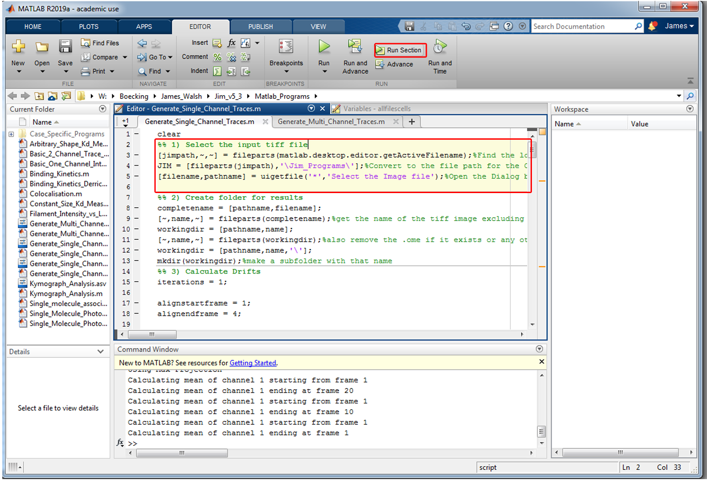

***************
Getting Started
***************

Running JIM
===========

Matlab
------

In the editor window, click on the section you want to run so that it turns yellow (shown below highlighted with a red box). Then click the Run Section Button (also highlighted in a red box below) at the top of the editor tab to run that section or alternatively press Ctrl + Enter on your keyboard .

Note that any time that you change a variable, you need to rerun the section that the variable is located within. All lines should end with a semicolon to hide the output.

Python
------
Python code is run in Python 3.5 using the Pycharm IDE (https://www.jetbrains.com/pycharm/) which is free for non-commercial users. After installation, open the Generate_Single_Channel_Traces.py file which is located in the Python_Programs folder. It should look like:

ImageJ
------
For ImageJ users, the generate single traces script can be opened by selecting Plugins->Jim_ImageJ->Generate Single Channel Traces on the home panel of ImageJ.

Colour Blind Settings
=====================
JIM's standard pipelines utilise multi-coloured image overlays to show the results of each step. By default these overlays are done in RGB (red, green, blue). This may cause problems for people who are colour blind. 

Matlab
------

To change these overlay colours, there are three parameters in Section 1: overlaycolour1, overlaycolour2 and overlaycolour3. These three parameters control the colours used for each layer of the overlay. The colours are defined in RGB so by default:
overlaycolour1 = [1, 0, 0] - which corresponds to red
overlaycolour2 = [0, 1, 0] - which corresponds to green
overlaycolour3 = [0, 0, 1] - which corresponds to blue

So to use magenta in place of red for instance change:
overlaycolour1 = [1, 0, 1]

Reminder to rerun this section to update the colour selections before moving on.

ImageJ
------
ImageJ has its own built-in colour adjusters to help with colour blind difficulties which do the same function:

.. image:: imagej_colorblind.png
  :width: 600
  :alt: Colorblind Adjustment in ImageJ
