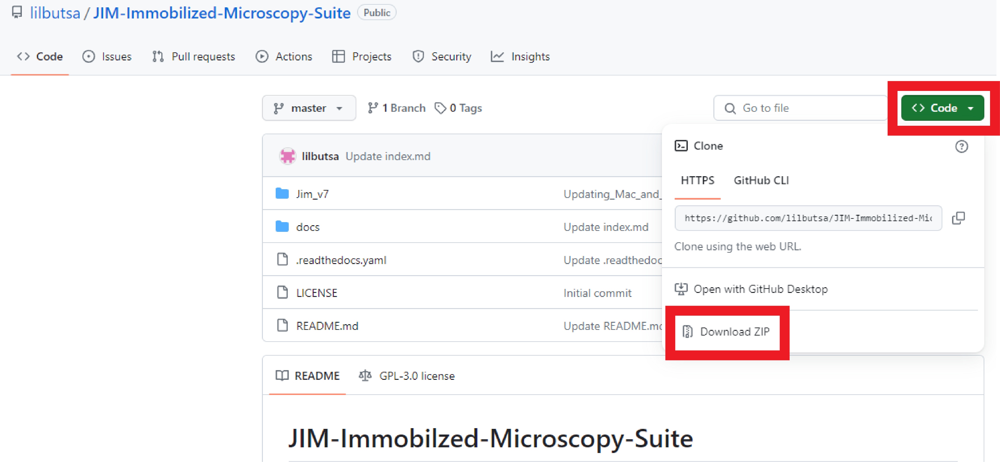
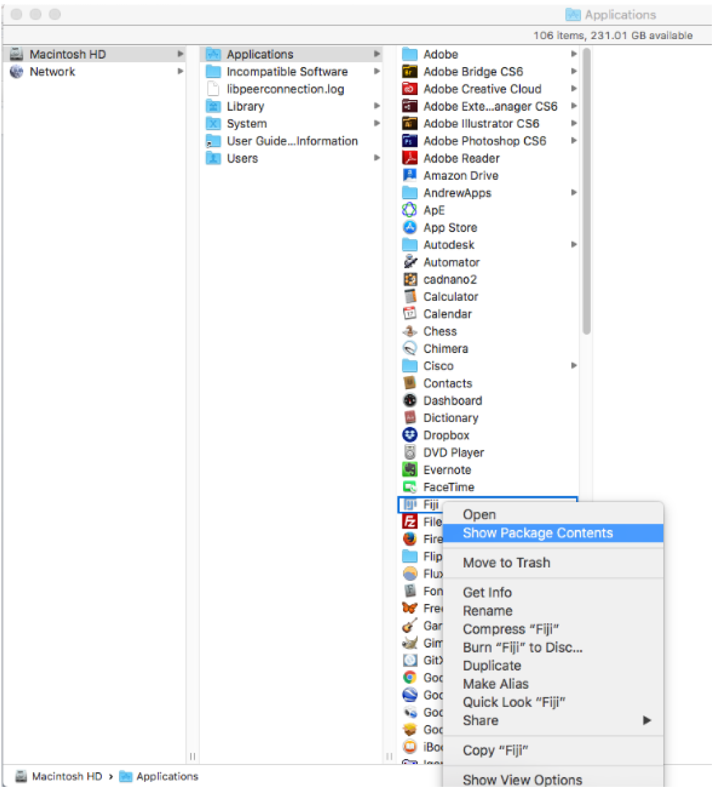

Installation
============

Downloading JIM
---------------
JIM is freely available for download from `Github <https://github.com/lilbutsa/JIM-Immobilized-Microscopy-Suite>`_.

To download the repository, on the homepage click code, then click download zip:

(you need to download the whole suite from the homepage; individual files cannot be downloaded). The files from the zip folder need to be extracted before use.

Prerequisites
-------------

The base programs of JIM are written C++ and are statically linked for portability. For windows the only prerequisite is the x86 Microsoft Visual C++ 2017 Redistributable package (<https://go.microsoft.com/fwlink/?LinkId=746571>).

.. _installation:

ImageJ Installation
-------------------

To run the standard JIM protocols using ImageJ, copy the two folders **ImageJ_Programs** and **c++_Base_Programs** from the Main JIM folder and paste them with all their contents into the folder plugins located in your ImageJ installation folder. 

If you are unsure about the plugins folder location, the plugins folder for FIJI can be located in FIJI by going File->Show Folder->Plugins

**Note for Mac Users:** To get to the plugins folder go to the applications folder and right click on the FIJI app and click on Show Package Contents: 

