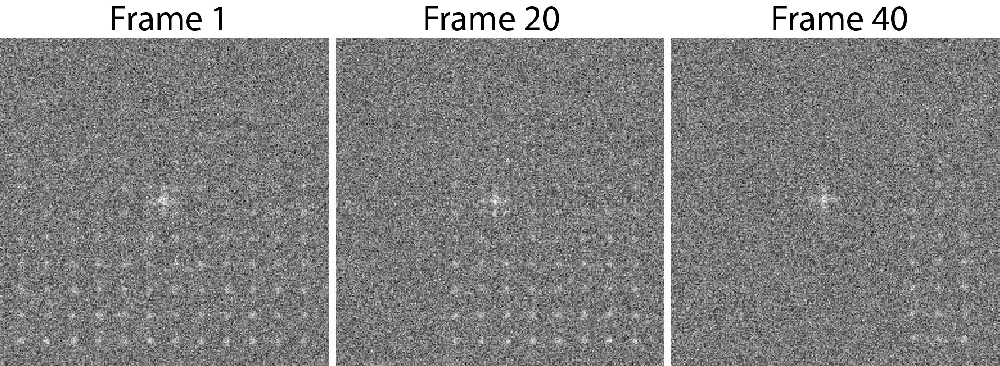

********************************************
Tutorial 1 - Single Channel Trace Generation
********************************************

This tutorial analyses an artificial example designed to introduce new users to the basic functionality of JIM and what a standard workflow looks like when working with single channel data. 

The test array is a tif stack containing 50 images each 256x256 pixels in size. The full image contains a 12x12 array of diffraction limited spots. Each row of spots gets increasingly bright allowing users to experiment with the detection limits of JIM. Every 4 frames, an additional column in the image stack becomes dark, to demonstrate the interplay in detection difficulty between how bright a particle is and how long it is present in images. There are two versions of this example data - with and without noise. Without noise provides a neat check that the measured intensities correspond to theoretical values. With noise provides a test for the detection limits of the software. 

The example with noise is *Tutorial_1_Jim_Test_Array.tif*. The without noise dataset *Tutorial_1_Jim_Test_Array_No_Noise.tif*. 

This tutorial will use the with noise example, however the without noise data can be used with the exact same parameters.

Users are strongly encouraged to open the dataset file with a program like ImageJ to get a feel for what the data looks like.

This dataset is generated in Mathematica using the *Tutorial_1_Jim_Test_Array_Generator.nb* program which is included in the Tutorial 1 folder, in case users wish to regenerate the data with different random numbers or modify it. 

The basic aim of this tutorial is to analyze the intensities and disappearance of spots over times in this video. This will be done using the The *Begin Here Generate Traces* program. This program has been implemented in Matlab, Python and ImageJ. All should give the same output.

The *Begin Here Generate Traces* pipeline contains 10 sections to generate traces for an image stack. Each stage can be rerun as required to adjust parameters for optimal detection. 
At the end of the protocol, there is then the option to batch analyse an entire folder of image stacks using the same parameters. This is helpful if multiple fields of view or repeats have been performed for an experiment.

0) Import Parameters
====================

Often there will be standard parameters that a user would like to use as a starting spot for analysing a type of data. Importing parameters gives the user a way to load those parameters.

The parameters used for this tutorial can be loaded by running this section and selecting the file *Examples_To_Run\\1a_Point_Array_No_Noise\\Tutorial_1_Final_Parameters.csv*

1) Select Input File
====================

Running this section should open a file selection window. Select the file *Tutorial_1_Jim_Test_Array.tif* which is located in the *Examples_To_Run\\1b_Point_Array_With_Noise folder\\* of the JIM distribution.

This section also automatically finds the Jim_Programs folder by assuming that the Generate_Single_Channel_Traces file is still in the Jim distribution file. If you want to shift the Generate_Single_Channel_Traces file to another location, you will need to manually set the JIM variable to the path name for the Jim_Programs folder.

There is no ".ome" on the end of the tif file so we can set **Additional Extensions to Remove** to 0.

The data is all contained in a single file so we can set **Multiple Files Per Image Stack** to false;

Running this section will create a folder in the same as the tiff stack with the same name as the tiff stack that the results of all analysis will be saved in. In this case a file called *Tutorial_1_Jim_Test_Array* will be created in the *1b_Point_Array_With_Noise* folder.

Note that if you are rerunning this analysis, this section may give you a warning that the directory already exists. This is not a problem, you can just ignore it.

2) Organise Channels
===================

This section combines multi-file tiffs into a single big-tiff and splits a multi-channel tiff stack into individual files for each channel to make it easier for downstream processing.

As this example is a single file single channel dataset, it just checks the order of files (using ome metadata if it exists) and copies the file to the anlysis folder in the correct order.

This is single channel data so set **Number of Channels** to 1. We know it is in order so we can **Disable Metadata**. We want to use the entire dataset so we set **Stack Start Frame** to 1 and **Stack End Frame** to -1.

We don't need to orientate the data at all so we can leave **Channels to Transform** empty. When this is the case, the last three parameters (**Vertical Flip**,**Horizontal Flip** and **Rotate**) are not used so can be set to anything.

After running this section, a tiff file called *Raw_Image_Stack_Channel_1.tif*

3) Align/Drift Correct
======================================

We only need to drift correct in this section as it is single channel data. Drift correction is calculated by aligning every image in a stack to a reference image using cross correlation. The tricky part in accurately drift correction is generating a good reference image. Using a single frame as the reference works well if there is strong signal. However, if there is low signal to noise, the noise in the reference image will cause significant errors in the drift calculation. Alternatively, a mean image made by averaging across a range of frames helps to average out the noise from a single image. However, any drift between the images used to make the mean image will cause a blurring of reference image which will also cause significant errors in the drift calculation. Ultimately, the aim is to find a balance between these two extremes which gives the best reference image possible. 

The final factor in deciding what frames to average for a reference image is that you want to choose frames when the majority of particles are present. The more signal in the reference image, the easier it is to align.

In cases with high drift and low signal to noise, it is possible to run the drift correction iteratively, where the drift corrected image stack is used to generate the reference image for the next round of alignments. For most cases, setting *iterations* = 1 is sufficient if there is reasonable signal.

In this example, all particles are present at the start and are reasonably bright but the data contains lots of drift, so it is reasonable to take an average of frames 1 to 5 for the reference image. To do this set the parameters:
iterations = 1
alignStartFrame = 1
alignEndFrame = 5

Max Shift Example
-----------------
The columns of particles in the dataset are evenly spaced, this  can lead to an artifact where the drift correction can align an image to to the wrong columns in the reference image. To see this, we can set the *Max Shift* to a large number like 1000, enable the save aligned stack and run the program. 

Obviously, this example is artificial, but similiar artifacts can be observed in real world data. In particular data with low signal to noise and transient bright aggregates

(Optional) Calculating the Accuracy of Drift Correction
-------------------------------------------------------
Given Jim_Test_Array_Exampl.tif is artificially generated data, the measured drift values can be compared to the exact drift values for each frame to calculate the accuracy of JIM alignment.  Running the Drift Correction section generates the file Aligned_Drifts.csv in the Jim_Test_Array_Example folder which can be opened with microsoft excel or similar and should look like:

Ensure that this excel file is closed before you rerun the alignment program otherwise the Drift Correction program will not save the drift values using the new alignment parameters. 

In this file each row corresponds to the drift measured in each frame for the x and y direction. To compare this to the actual drift of the image stack, there is an excel file in the Example_Data folder called Jim_Test_Array_Example_drifts.xls. Pasting the measured drifts into the first two columns of this file will calculate the error in drift alignment:

Overall this shows that the average error in drift is 0.37 pixels for a single iteration, which is sufficient for most applications. This can be reduced to 0.13 pixels using 3 iterations and goes as low as 0.1 pixels using 100 iterations. However, the increase in drift correction accuracy has a trade off where increasing iterations demands more computational time to allow detection of dimmer particles. 

For the rest of this analysis we will use the output from running the drift correction section with:
iterations = 3
alignStartFrame = 1
alignEndFrame = 5

REMINDER: rerunning this section with these settings is necessary to ensure that these values are used so subsequent parts of this tutorial can be followed. 

4) Make Sub-Average
===================

Having drift corrected the entire stack, the next section determines which section of the image stack is used for detection. In this section you select a range of frames from the drift corrected stack e.g. from frame 1- 10, to produce a mean image. This mean image is then used to detect particles for analysis. Increasing the number of frame to average allows the detection of long-lived dim particles (top row) but reduces sensitivity for short lived particles (left column) because the short lived signal is averaged out across more frames.

This can be demonstrated by running this section multiple times with different detectionEndFramevalues. Set the parameters as:
useMaxProjection = false
detectionStartFrame = 1
Then change the detectionEndFrame variable to 5, 25 and 50. The results should appear as shown

As the detectionEndFrame parameter is increased the noise in the image decreases (notice the background grey becoming more even as the more frames are used) which makes the top rows of dim particles (yellow boxes below) much clearer. However, averaging makes the short lived particles to the left the image dimmer (pink boxes below).

(Optional) Detection Using a Maximum Projection
-----------------------------------------------

JIM also provide the option to create an image using the max projection rather than the mean. To do this set useMaxProjection = true. This is useful if you have bright short lived states that are not synchronised, for example transient binding. However, as the max is also taken for the background, dim particle detection may becomes inherently difficult. Running this section with the parameters:

Using a max projection, the brightness of spots are less affected by whether they only exist for a small number of frames (all spots on each row are approximately the same intensity). However, the background is much higher than using the subaverageing approach so most particles in the top few rows of this image would be impossible to detect. Good signal to noise is important to use the max projection as a method to detect particles that are transiently present in few frames of the image. 

If you played with this optional max projection; ensure that you rerun 
useMaxProjection = false
detectionStartFrame= 1
detectionEndFrame = 25
Before moving on with the tutorial

5) Detect Particles
===================

This section detects the particles in the image stack. The program essentially consists of two parts. The first part is effectively a threshold which detects local increases in intensity above the surrounding background to find ‘detected regions’ (region of interest or ROI). The second part filters these detected regions based on size and shape to isolate the desired particles that you are interested for downstream analysis.

The thresholding process involves a few pre-processing steps. A full description is available in the Detect_Particles.exe documentation but is superfluous for this tutorial. For virtually all users, it is sufficient to assume that the cutoff parameter controls the thresholding level and will normally lie in the range of 0.2-1.5. 

To determine the correct value to use for the cutoff we first want to turn all of the filters off. 
To do all this set:
left = 0
right = 0
top = 0
bottom = 0
minCount = -1
maxCount =10000000
minEccentricity = -0.1; 
maxEccentricity = 1.1;
minLength = 0;
maxLength = 10000000
maxDistFromLinear = 10000000

We can also adjust the detection image to give good contrast by setting: 
displayMin = 0;
displayMax = 3;

We then want to run the detect particles section with a range of cutoff values. The image used for detection is shown in red, and the detected regions are in blue. Bright spots which have been detected will appear pinky/white.

Normally it is good practice to start with a low value where the background is being fully detected (cutoff = 0.5  for this example) which should look like:

Note the large amount of background being detected (the blue random shapes).
We then steadily increase the cutoff value until the point where minimal background is detected but all particles are still detected. In this example it occurs around cutoff = 0.85 which looks like:

If the cutoff value were pushed too high, then the ability to detect particles becomes reduced, this is shown below with a cutoff = 1.5. 

It is important to avoid having particles that only have a couple of pixels detected (like for most of the particles in the 2nd  and 3rd row and the 1st column in this example) as it’s hard to differentiate that from background noise. 

Rerun the cutoff = 0.85 before continuing to look at filters.

Having thresholded, we can then apply filters to isolate particles of interest. This program can be used to detect a range of shapes, this is demonstrated in the next tutorial (Tutorial 2 - Generating Multi Channel Traces with Jim_Test_2_Channel_Example). However, to keep this initial tutorial reasonably simple we will just look at the settings used to detect diffraction limited spots.

We typically want to exclude particles close to the edge to avoid situations where only part of the particle has been detected. To do this we set:
left = 10
right = 10
top = 10
bottom = 10
To exclude all particles within 10 pixels of any edge. The detection now looks like:

Objects excluded by filters are shown in green; which are all the small particles near the edge of the image.

Next we want to exclude everything that is too small or too large (like the cross hair), as they tend to be rubbish. To do this we set the minimum number of pixels in a region to 10 and max to 100 by setting:
minCount = 10
maxCount = 100
This gives a detection image of

Further constraints can be added, in particular setting a max eccentricity, to further filter for single particles. This is explored further in the next tutorial. 

6) Additional Backgrounds
=========================

7) Expand Shapes
================

The next stage of analysis expands each detected region to make sure that all of the fluorescence from each particle is completely confined within the detected region. 

The area further surrounding the detected region is then used to estimate the background fluorescence surrounding the corresponding detected particle to be subtracted off to obtain the particles signal. Using the local background surrounding each spot, as opposed to one global background value for all particles, compensates for any unevenness in the illumination profile in the image or differences in focus of the field of view. 

There are three parameters for this section:

foregroundDist - the pixel distance that the detected region of interest is to be expanded to ensure that it contains all of the fluorescence for that spot.

backInnerDist - the distance to expand from the detected region before the inner edge of the background region. Note that if this variable is set to less than foregroundDist , it will automatically be set equal to foregroundDist , i.e. the background starts from the edge of the expanded detected region.

backOuterDist - the distance to expand the detected region to reach the edge of the background region
Schematically these are

The foreground region (the region used to measure the fluorescence intensity) is both the yellow and green regions.

Setting these values to:

foregroundDist = 4.1; 
backInnerDist = 4.1;
backOuterDist = 20;
Gives:

Here the detection image is shown in red, the expanded detect regions are in green and the background regions are shown in blue. The combination of red and green gives yellow, showing that the fluorescence for each particle is well contained within each green region.

The background area will excludes all other expanded detected regions as well as detected regions that was excluded by the filters. This is useful as it means that any bright spots in the background noise will not skew the background reading. 

8) Calculate Traces
===================
The final step of generating traces outputs a table of the intensity of each particle over time. Drift is accounted for over the entire image stack and background noise is subtracted from the intensity of each detected region. Each detected region is considered to be a particle and the intensity, measured in arbitrary units, of that particle is tracked over time, measured in frames. 
Running this section creates the file Channel_1_Flourescent_Intensities.csv in the Jim_Test_Array_Example folder. Opening this in microsoft excel (or similar) will show a table like this:

In this data, each row corresponds to individual analysed particles where each column holds the intensity value for each frame. Plotting a single row will show the trace for that particle. For example plotting the 100th line gives the plot:

Where we can see by eye that this particle had an intensity of around 3500 and disappears in the 41st frame. 

Setting verboseOutput = true creates an additional output (Channel_1_Verbose_Traces.csv in the Jim_Test_Array_Example folder) which gives statistics for each intensity such as position of particle, minimum, maximum, mean and median intensities for background and foreground etc.  Full details of this file can be found in the Calculate_Traces.exe program documentation. This can be helpful for troubleshooting but for the most part is not needed and can become a very large file if the image stack has a lot of frames and a lot of regions of interest. Therefore, it is recommended to keep  verboseOutput = false. 

Running this section also saves all the variables that have been used to generate these traces. The file is called Trace_Generation_Variables.csv and is located in the Jim_Test_Array_Example folder. It should look like: