********************************************
Tutorial 1 - Single Channel Trace Generation
********************************************

All data needed to follow this tutorial is found in the folder *Examples_To_Run\\1_Jim_Test_Array\\*.

Before doing this tutorial, make sure you are know how to `run a JIM script <https://jim-immobilized-microscopy-suite.readthedocs.io/en/latest/getting_started.html#>`_ and if you are using ImageJ you have the `plugins installed <https://jim-immobilized-microscopy-suite.readthedocs.io/en/latest/installation.html#imagej-installation>`_.

This tutorial analyses an artificial example designed to introduce new users to the basic functionality of JIM and what a standard workflow looks like when working with single channel data. 

The test array is a tif stack containing 50 images. The inital images contains a 10x10 array of diffraction limited spots. Each row of spots gets increasingly bright allowing users to experiment with the detection limits of JIM. Every five frames, an additional column in the image stack becomes dark, to demonstrate the interplay in detection difficulty between how bright a particle is and how long it is present in images. A montage of this dataset is shown below.

There are two versions of this example data - with and without noise. Without noise provides a neat check that the measured intensities correspond to theoretical values. With noise provides a test for the detection limits of the software. The example with noise is *Tutorial_1_Jim_Test_Array.tif*. The without noise dataset *Tutorial_1_Jim_Test_Array_No_Noise.tif*. This tutorial will use the with noise example, however the without noise data can be used with the exact same parameters.

Users are strongly encouraged to open the dataset file with a program like ImageJ to get a feel for what the data looks like.

.. image:: Tut_1_montage.png
  :width: 600
  :alt: Montage of Tutorial_1_Jim_Test_Array.tif

*Montage of the dataset: The 10x10 array of diffraction limited spots. Every five frames one column of particles from the left disappears so that in frame one all 10 columns are present, in Frame 20 there are only 7 columns left and in Frame 40 there are only 3. Each successive row of particles is brighter than the previous. The top rows are so dim that with noise they unrecognisable.*

This dataset is generated in Mathematica using the *Tutorial_1_Jim_Test_Array_Generator.nb* program which is included in the Tutorial 1 folder, in case users wish to regenerate the data with different random numbers or modify it. 

The basic aim of this tutorial is to analyze the intensities and disappearance of spots over times in this video. This will be done using the The *Begin Here Generate Traces* program. Further details of the parameters in this pipeline can be found `here <https://jim-immobilized-microscopy-suite.readthedocs.io/en/latest/begin_here_generate_traces.html>`_

The *Begin Here Generate Traces* pipeline contains 10 sections to generate traces for an image stack. Each stage can be rerun as required to adjust parameters for optimal detection. 
At the end of the protocol, there is then the option to batch analyse an entire folder of image stacks using the same parameters. This is helpful if multiple fields of view or repeats have been performed for an experiment.

0) Import Parameters
====================

Often there will be standard parameters that a user would like to start from for analysing a type of data. Importing parameters gives the user a way to load those parameters.

The parameters used for this tutorial can be loaded by running this section and selecting the file *Examples_To_Run\\1a_Point_Array_No_Noise\\Tutorial_1_Final_Parameters.csv*

The final parameters for this tutorial are also in a table `here <https://jim-immobilized-microscopy-suite.readthedocs.io/en/latest/tut_1_single_channel.html#final-parameters>`_

1) Select Input File
====================

Running this section should open a file selection window. Select the file *Tutorial_1_Jim_Test_Array.tif* which is located in the *Examples_To_Run\\1b_Point_Array_With_Noise folder\\* of the JIM distribution.

This section also automatically finds the Jim_Programs folder by assuming that the Generate_Single_Channel_Traces file is still in the Jim distribution file. If you want to shift the Generate_Single_Channel_Traces file to another location, you will need to manually set the JIM variable to the path name for the Jim_Programs folder.

There is no ".ome" on the end of the tif file so we can set **Additional Extensions to Remove** to 0.

The data is all contained in a single file so we can set **Multiple Files Per Image Stack** to false;

Running this section will create a folder in the same as the tiff stack with the same name as the tiff stack that the results of all analysis will be saved in. In this case a file called *Tutorial_1_Jim_Test_Array* will be created in the *Examples_To_Run\\1_Jim_Test_Array\\* folder.

Note that if you are rerunning this analysis, this section may give you a warning that the directory already exists. This is not a problem, you can just ignore it.

2) Organise Channels
====================

This section combines multi-file tiffs into a single big-tiff and splits a multi-channel tiff stack into individual files for each channel to make it easier for downstream processing.

As this example is a single file single channel dataset, it just checks the order of files (using ome metadata if it exists) and copies the file to the anlysis folder in the correct order.

This is single channel data so set **Number of Channels** to 1. We know it is in order so we can **Disable Metadata**. We want to use the entire dataset so we set **Stack Start Frame** to 1 and **Stack End Frame** to -1.

We don't need to orientate the data at all so we can leave **Channels to Transform** empty. When this is the case, the last three parameters (**Vertical Flip**,**Horizontal Flip** and **Rotate**) are not used so can be set to anything.

After running this section, a tiff file called *Raw_Image_Stack_Channel_1.tif* should have been created in the analysis folder.

3) Align/Drift Correct
======================

We only need to drift correct in this section as it is single channel data. Drift correction is calculated by aligning every image in a stack to a reference image using cross correlation. The tricky part in accurately drift correction is generating a good reference image. Using a single frame as the reference works well if there is strong signal. However, if there is low signal to noise, the noise in the reference image will cause significant errors in the drift calculation. Alternatively, using a mean image, made by averaging across a range of frames, helps to average out the noise from a single image. However, any drift between the images used to make the mean image will cause a blurring of reference image which will also cause significant errors in the drift calculation. Ultimately, the aim is to find a balance between these two extremes which gives the best reference image possible. 

The final factor in deciding what frames to average for a reference image is that you want to choose frames when the majority of particles are present. The more signal in the reference image, the easier it is to align.

In cases with high drift and low signal to noise, it is possible to run the drift correction iteratively, where the drift corrected image stack is used to generate the reference image for the next round of alignments. For most cases, setting *iterations* = 1 is sufficient if there is reasonable signal.

In this example, all particles are present at the start and are reasonably bright but the data contains lots of drift, so it is reasonable to take an average of frames 1 to 5 for the reference image. To do this set the parameters:

**Iterations** = 1

**Alignment Start Frame** = 1

**Alignment End Frame** = 5

**Max Shift** = 10

After running this section, two images should open showing a before and after of the mean of the entire stack for alignment. These should look like:

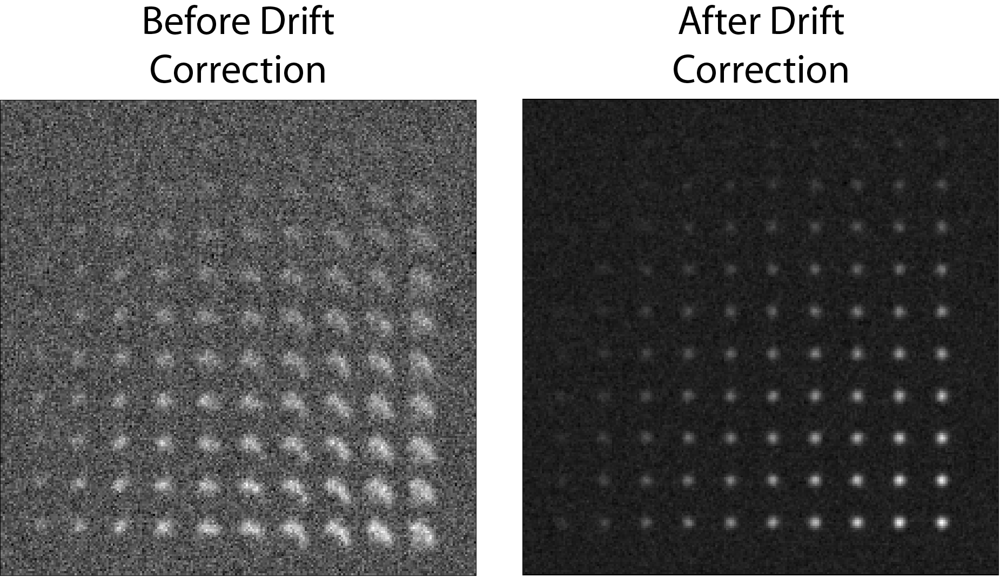

*The mean projection of the dataset before and after drift correction. Without drift correction, individual points are smeared because the sample moves. The drift correction is able to realign frames so the mean is of clean spots*

When generating the final traces, the detected regions of interest are shifted for each frame to account for drift rather that shifting the image itself. A consequence of this is that it isn't necessary to output the drift corrected image stack, however this can still be anabled using the **Save Aligned Stack** variable is desired.   

(Optional) Max Shift Example
----------------------------
The columns of particles in this dataset are evenly spaced, this can lead to an artifact where the drift correction can align an image to to the wrong columns in the reference image. To see this, we can set the *Max Shift* to a large number like 1000, enable the **Save Aligned Stack** and run the program. 

Running this section should generate the file *Alignment_Channel_1_Aligned_Stack.tiff* in the analysis folder. Opening this file and examining it, the columns of particles can be seen to jump around erratically. Limiting Max Shift to a value less than the width of columns (for example 10), forces the drift correction to only align on the correct column.

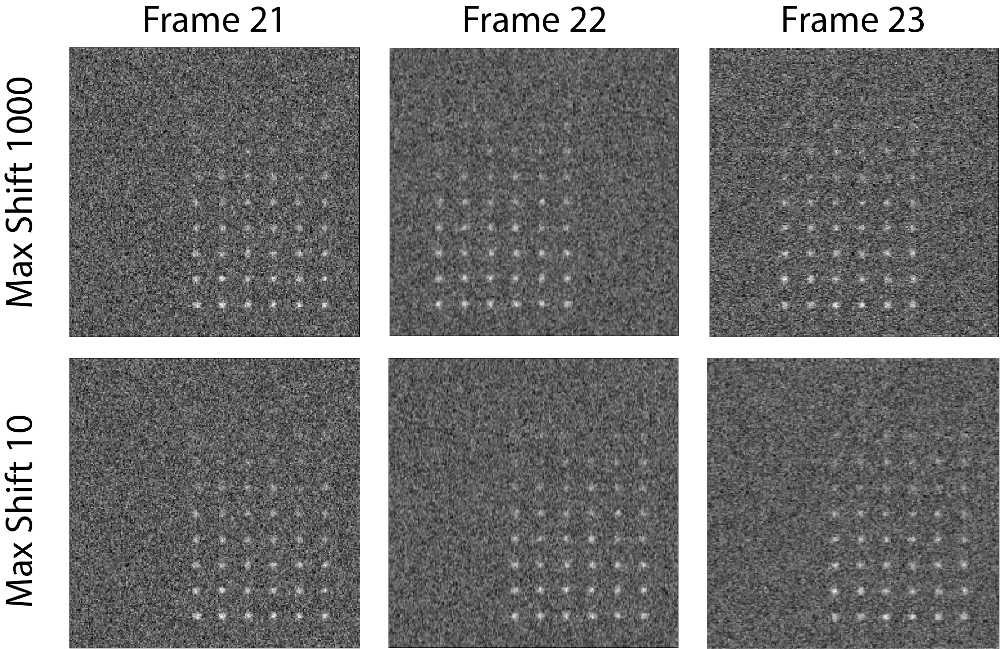

*The drift correction can erroneously jump accross columns when allowed to align to anywhere in the image by setting Max Shift to 1000. This can be avoided by only searching for the best correlation within 10 pixels.*

It is equally important that the **Max Shift** parameter is set to a value larger than the total drift observed in the experiment, otherwise the program will ignore the correct alignment and align to noise instead!

Obviously this example is artificial, but similiar artifacts can be observed in real world data. In particular data with low signal to noise and transient bright aggregates can cause artifacts as the drift correction tries to overlay the aggregates rather than the actual data. 

(Optional) Calculating the Accuracy of Drift Correction
-------------------------------------------------------
This dataset is artificially generated, so the measured drift values can be compared to the exact drift values for each frame to calculate the accuracy of JIM alignment.  Running the Drift Correction section generates the file *Alignment_Channel_1.csv* in the analysis folder which can be opened with microsoft excel or similar and should look like:

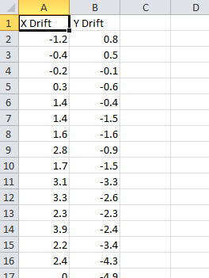

*The calculated distance (in pixels) that each frame needs to be shifted in the x and y direction to overlay with the reference image.* 

Ensure that this excel file is closed before you rerun the alignment program otherwise the Drift Correction program will not save the drift values using the new alignment parameters. 

In this file each row corresponds to the drift measured in each frame for the x and y direction. To compare this to the actual drift of the image stack, there is an excel file in the data folder called *Jim_Test_Array_Example_drifts.xls*. Pasting the measured drifts into the first two columns of this file will calculate the error in drift alignment:

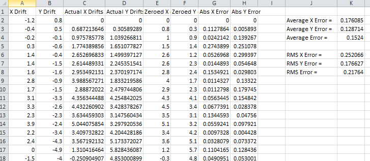

*The drift correction accuracy excel sheet (Jim_Test_Array_Example_drifts.xls) which compares the calculated drifts the exact values.*

Overall this shows that the average error in drift is 0.15 pixels for a single iteration. Regions or interest for traces are measured to the nearest pixel, so any drift correction to below half a pixel will result in optimal traces.

Play around, try different settings and see how the accuracy of drift correction changes. Just remember that rerunning this section with the original settings is necessary to ensure that these values are used so subsequent parts of this tutorial can be followed. 

4) Make Sub-Average
===================

Having drift corrected the entire stack, the next section determines which section of the image stack is used for detection. In this section you select a range of frames from the drift corrected stack e.g. from frame 1- 10, to produce a mean image. This mean image is then used to detect particles for analysis. Increasing the number of frame to average allows the detection of long-lived dim particles (top row) but reduces sensitivity for short lived particles (left column) because the short lived signal is averaged out across more frames.

This can be demonstrated by running this section multiple times with different detectionEndFramevalues. Set the parameters as:

**Use Max Projection** = false

**Detection Start Frames** = 1

**Channels Weights** = 1

Then change the **Detection End Frames** variable to 5, 25 and 50. The results should appear as shown

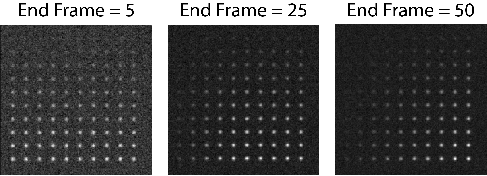

*As the Detection Start Frames parameter is increased the noise in the image decreases (background grey becoming more even as the more frames are used) which makes the top rows of dim particles Easier to identify. However, averaging makes the short lived particles to the left the image dimmer as they are being summed with more frames where they are not present.*

Ultimately, the aim is to find the balance to take as large of a window as possible to minimise noise, but not so large that transient particles are also getting averaged out. For this data we will take the **Detection End Frames** = 25. Please rerun this section with the correct values before continuing.  

(Optional) Detection Using a Maximum Projection
-----------------------------------------------

JIM also provide the option to create an image using the max projection rather than the mean. This is useful if you have bright short lived states that are not synchronised, for example transient binding. However, as the max is also taken for the background, dim particle detection may become difficult. Running this section with the parameters:

**Use Max Projection** = true

**Detection Start Frames** = 1

**Detection End Frames** = -1

**Channels Weights** = 1

These parameters will calculate the max projection of the entire dataset (negative numbers for **Detection End Frames** go from the end of the stack with -1 as the last frame):

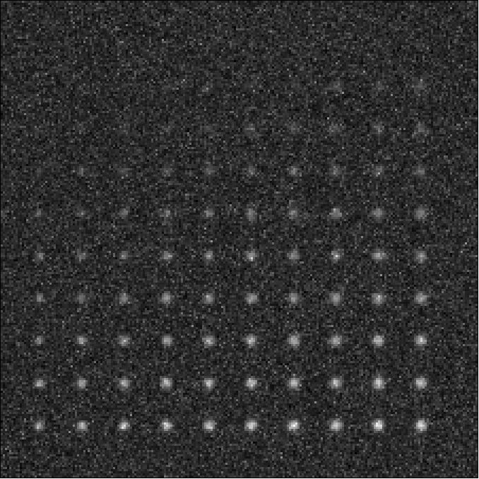

*Max projection of the full image stack. Particle intensities are less affected by the time they are present, but background is much higher.*

Using a max projection, the brightness of spots are less affected by whether they only exist for a small number of frames (all spots on each row are approximately the same intensity) in comparison to using the mean projection. However, the background is much higher than using the subaverageing approach so most particles in the top few rows of this image would be impossible to detect. Good signal to noise is important to use the max projection as a method to detect particles that are transiently present in few frames of the image. 

If you played with the max projection ensure that you rerun detection with the previous parameters before continuing.

5) Detect Particles
===================

This section detects the particles in the image stack. The program essentially consists of two parts. The first part is effectively a threshold which detects local increases in intensity above the surrounding background to find ‘detected regions’ (region of interest or ROI). The second part filters these detected regions based on size and shape to isolate the desired particles that you are interested for downstream analysis.

The thresholding process involves a few pre-processing steps. A full description is available in the Detect_Particles.exe documentation but is superfluous for this tutorial. For virtually all users, it is sufficient to assume that the cutoff parameter controls the thresholding level and will normally lie in the range of 0.2-1.5. 

To determine the correct value to use for the cutoff we first want to turn all of the filters off. 
To do all this set:

**Min. dist. from left edge** = 0

**Min. dist. from right edge** = 0

**Min. dist. from top edge** = 0

**Min. dist. from bottom edge** = 0

**Min. pixel count** = -1**

**Max. pixel count** =10000000

**Min. eccentricity** = -0.1

**Max. eccentricity** = 1.1

**Min. length** = 0

**Max. length** = 10000000

**Max. dist. from linear** = 10000000

**Min. separation** = -1;

For matlab, we can also adjust the detection image to give good contrast by setting: 

displayMin = 0;

displayMax = 3;

We then want to run the detect particles section with a range of cutoff values. The image used for detection is shown in red, and the detected regions are in blue. Bright spots which have been detected will appear pinky/white.

Normally it is good practice to start with a low value where the background is being fully detected (**cutoff** = 0.3  for this example). We then steadily increase the cutoff value until the point where minimal background is detected but all particles are still detected. In this example it occurs around **cutoff** = 0.6. If the cutoff value were pushed too high, then the ability to detect particles becomes reduced, for example with a **cutoff** = 1.5. 

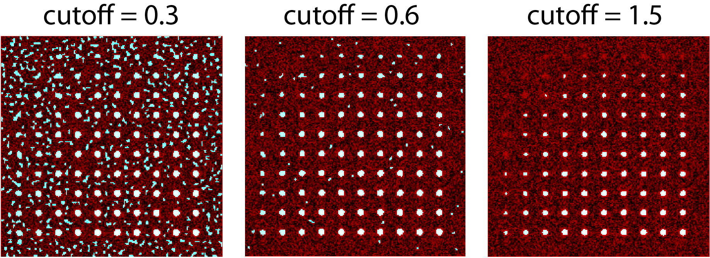

*Varying the cutoff for detection. With cutoff = 0.3, large amounts of background are being detected (the blue random shapes). These more or less disappear when the cutoff is increased to 0.6. Going too high (cutoff = 1.5) causes all of the top row and most of the first column to no longer be detected.*

It is important to avoid having particles that only have a couple of pixels detected (like for most of the particles in the 2nd  and 3rd row and the 1st column in this example) as it’s hard to differentiate that from background noise. 

Rerun the cutoff = 0.6 before continuing to look at filters.

Having thresholded, we can then apply filters to isolate particles of interest. This program can be used to detect a range of shapes, this is demonstrated in the `Tutorial 2<https://jim-immobilized-microscopy-suite.readthedocs.io/en/latest/tut_2_multi_channel.html#>`_. However, to keep this initial tutorial reasonably simple we will just look at the settings used to detect diffraction limited spots.

We typically want to exclude particles close to the edge to avoid situations where only part of the particle has been detected. It is also important to ensure that particles don't drift off the edge of the image over the course of the experiment. Normally a value of 25 for real life data provides a good safety net. In this example, however, we have made the image size as small as possible to reduce file sizes - so we just want to exclude particles closer than 10 pixels from the edge. To do this we set:
**Min. dist. from left edge** = 10

**Min. dist. from right edge** = 10

**Min. dist. from top edge** = 10

**Min. dist. from bottom edge** = 10

Next we want to exclude everything that is too small or too large, as they tend to be rubbish. To do this we set the minimum number of pixels in a region to 10 and max to 100 by setting:

**minCount** = 10

**maxCount** = 100

This gives a detection image of:

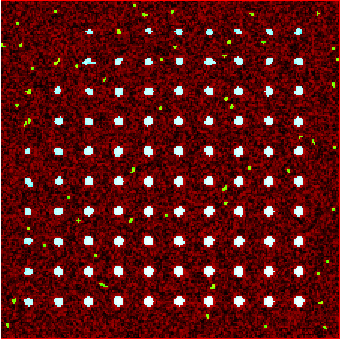

*Filtering detected regions to select particles of interest. Blue areas are the particles that will be used for generating traces. Objects excluded by filters are shown in green; which are all the small particles near the edge of the image.*

Further constraints can be added, in particular setting a max eccentricity, to further filter for single particles. This is explored further in the next `Tutorial 2<https://jim-immobilized-microscopy-suite.readthedocs.io/en/latest/tut_2_multi_channel.html#>`_.

6) Additional Backgrounds
=========================

This section exists to give the user the ability to detect additional areas to exclude from background detection. This would typically be used for multi-channel data if regions are detected using one channel, then this section can be used to exclude non-colocalised particles from the other channels. For single channel data, it can be used to exclude particles that appear after the detection image used for detection above.

As neither of these cases are relevant here, we can set *Detect additional background = false* and continue to the next section.

7) Expand Shapes
================

The next stage of analysis expands each detected region to make sure that all of the fluorescence from each particle is completely confined within the detected region. 

The area further surrounding the detected region is then used to estimate the background fluorescence surrounding the corresponding detected particle to be subtracted off to obtain the particles signal. Using the local background surrounding each spot, as opposed to one global background value for all particles, compensates for any unevenness in the illumination profile in the image or differences in focus of the field of view. The background area will excludes all other expanded detected regions as well as detected regions that was excluded by the filters. This is useful as it means that any bright spots in the background noise will not skew the background reading. 

The typical values used are:

**foregroundDist** = 4.1; 

**backInnerDist** = 4.1;

**backOuterDist** = 20;

Details of these parameters can be found `here<https://jim-immobilized-microscopy-suite.readthedocs.io/en/latest/begin_here_generate_traces.html#expand-regions>`_.

Running this section gives:

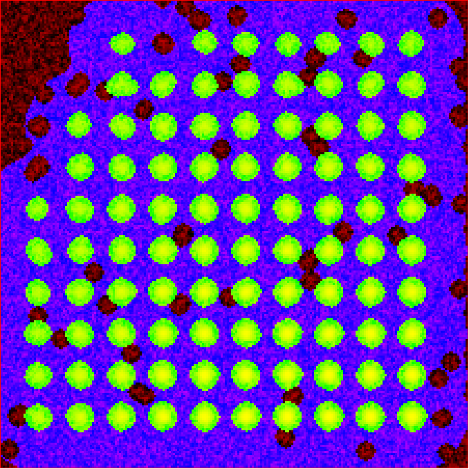

*Expanded shapes for each region. The detection image is shown in red, the expanded detect regions are in green and the background regions are shown in blue. The combination of red and green gives yellow, showing that the fluorescence for each particle is well contained within each green region.*

These default values work for the vast majority of cases. The key points to check in the output image is that all of the flourescence (yellow) is contained in the green areas, and that the background area is sufficient that there is a reasonable blue area for every particle. The only times this is likely to not be the case is if you have a mix of very bright and dim particles, if the microscope has a pixel size much bigger, or smaller, then Nyquist sampling, or if the sample is really crowded.

8) Calculate Traces
===================
The final step of generating traces outputs a table of the intensity of each particle over time. Drift is accounted for over the entire image stack and background noise is subtracted from the intensity of each detected region. Each detected region is considered to be a particle and the intensity, measured in arbitrary units, of that particle is tracked over time, measured in frames. 
Running this section creates the file Channel_1_Flourescent_Intensities.csv in the analysis folder. Opening this in microsoft excel (or similar) will show a table like this:

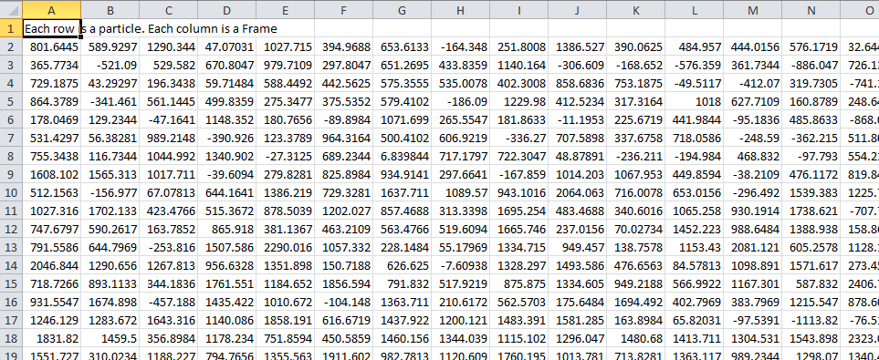

In this data, each row corresponds to individual analysed particles where each column holds the intensity value for each frame. Plotting a single row will show the trace for that particle. For example plotting the 50th line gives the plot:

Where we can see by eye that this particle had an intensity of around 2500 and disappears in the 35st frame.

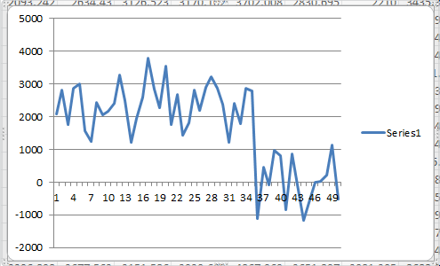
 

Setting verboseOutput = true creates an additional output (Channel_1_Verbose_Traces.csv in the analysis folder) which gives statistics for each intensity such as position of particle, minimum, maximum, mean and median intensities for background and foreground etc.  Full details of this file can be found in the Calculate_Traces.exe program documentation. This can be helpful for troubleshooting but for the most part is not needed and can become a very large file if the image stack has a lot of frames and a lot of regions of interest. Therefore, it is recommended to keep  verboseOutput = false. 

Running this section also saves all the variables that have been used to generate these traces. The file is called Trace_Generation_Variables.csv and is located in the analysis folder. This file can be used to reload the same parameters back into this program in the future. 

9) View Traces
==============

Running the next section will display two figures. The first is an image showing the particle number for each detected region. This makes it easy to connect which trace corresponds to which particle. For reference, this image is called Detected_Filtered_Region_Numbers.tiff in the results folder and was actually generated by the detect particles section. It should look like this:

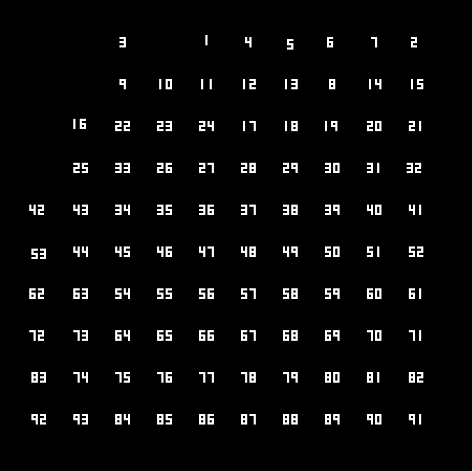

The second figure should display a page of traces where the particle intensity is plotted against the frame number. The variable pageNumber dictates which page of results are displayed. For example, setting this variable to pageNumber = 1 will print traces 1 to 36, 
The figure may look different when JIM is run across different program but the underlying plots should look similar to:

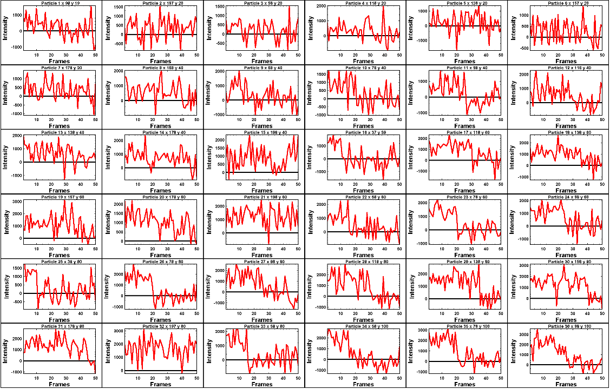

Looking at the particle number image, we see that this first page is displaying particles from the top of the image where particles are extremely dim. This is reflected by these traces being incredibly noisy. 

As this is artificial data, we know what the theoretical intensity for each spot is. For convenience, in the generating this example, we made the intensity proportional to the y position so that we can just apply a conversion factor. To calculate the theoretical intensity of each point multiply the Y position by 20. For example, Particle 33  (the bottom row, third column of the table) has a y position of 80 and so should have an intensity of 80x20=1600.

To work out the theoretical disappearing time of each point divide the x by 4 then round it to the nearest divisor of 5. For example particle 33 has an x position of 58 so 58/4 = 14.5 which would then round to 15. 

In reality, it is going to be near impossible to step fit the top three rows of traces - the signal to noise is simply too low. However, most of the bottom three lines are borderline possible to step fit.

Changing the page number shows that as you move down the image, the signal to noise of traces increases as expected. For example, page two looks like:

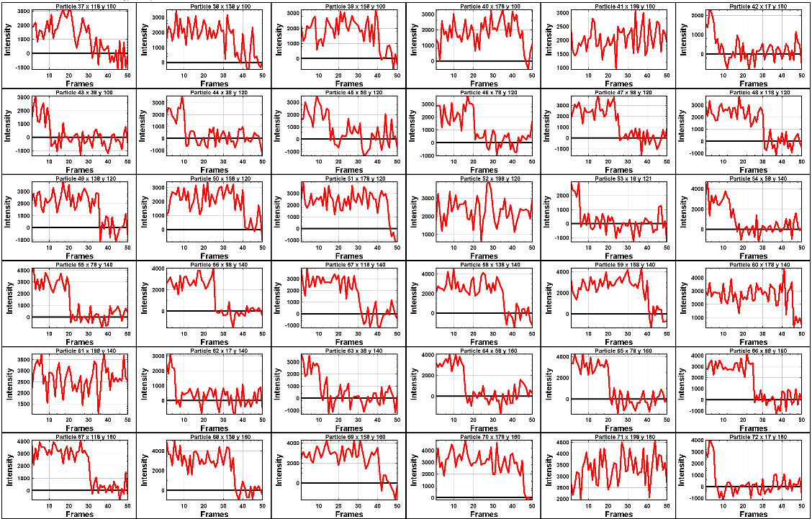

The difference between frames where particles are present versus absent in these traces are more pronounced. Most of these traces can be reasonably step fit. 

Moving through the pages (by increasing the pageNumber variable), we see that as we move down the image steps become more and more pronounced.

JIM measures the integrated fluorescence intensity over the foreground region. For diffraction limited spots, like this example, it is sometimes helpful to convert these values to the peak amplitude of the best fit gaussian. To do this, you need to know the standard deviation of the best fit Gaussian (set by the microscope design). Conversion is then a simple case of dividing the integrated intensity by 2π σ^2. In this example, the standard deviation of each gaussian is (10/π)^0.5 giving a conversion factor of 20. (how convenient…) So a particle with an intensity of 2000 would have an amplitude of 100.

Congratulations! You’ve completed your first tutorial. Generating traces is the first step in almost all quantification protocols (except kymograph analysis which is another tutorial for another day…). Once you have traces, you can then manipulate them how you please to extract whatever information you desire.

For example, if this data were photobleaching single fluorophores, you would then run these traces through the single-molecule photobleaching routine which would stepfit the traces and then use the step heights to work out single fluorophore intensities and the step times to work out bleaching times. This is done in detail in the Single-Molecule Photobleaching Tutorial.

Before that however, I would strongly recommend doing the Generate Multi-Channel Traces tutorial to learn how to generate traces for data with multiple colours and also particles of arbitrary shapes.

Final Parameters
===================
The final parameters used for this tutorial can be loaded from the file *Tutorial_1_Final_Parameters.csv* in the dataset folder. The parameters are :

.. csv-table:: Final Tutorial 1 Parameters
   :file: Tutorial_1_Final_Parameters.csv
   :widths: 30, 30
   :header-rows: 0
