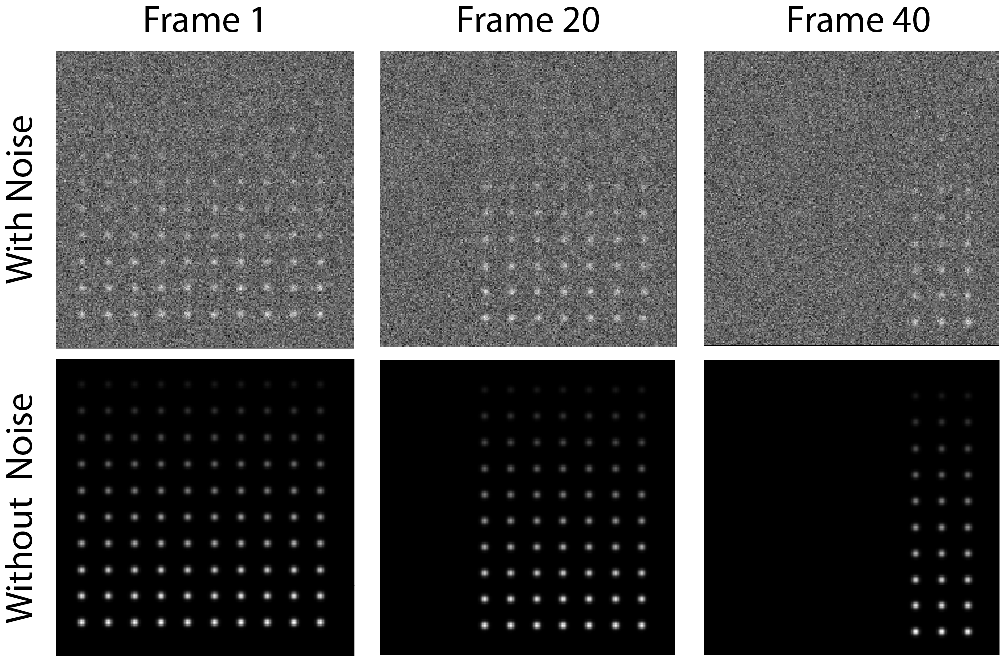

********************************************
Tutorial 1 - Single Channel Trace Generation
********************************************

This is an artificial example designed to introduce new users to the basic functionality of JIM and what a standard workflow looks like when working with single channel data. 

There are two versions of this example data - with and without noise. Without noise provides a neat check that the measured intensities correspond to theoretical values. With noise provides a test for the detection limits of the software. 

The raw data for the without noise version is found in *Examples_To_Run\1_Point_Array_No_Noise\Tutorial_1_Jim_Test_Array_No_Noise.tif*. The example with noise is found in *Examples_To_Run\1b_Point_Array_With_Noise\Tutorial_1_Jim_Test_Array.tif*

This tutorial will use the with noise example, however the without noise data can be used with the exact same parameters.

Users are strongly encouraged to open this file with a program like ImageJ to get a feel for what the data looks like. The test array is a tif stack containing 50 images each 256x256 pixels in size. The full image contains a 12x12 array of diffraction limited spots. Each row of spots gets increasingly bright allowing users to experiment with the detection limits of JIM. Every 4 frames, an additional column in the image stack becomes dark, to demonstrate the interplay in detection difficulty between how bright a particle is and how long it is present in images. This data is generated in Mathematica using the *\1a_Point_Array_No_Noise\Tutorial_1_Jim_Test_Array.nb* program which is included in the Examples_To_Run folder in case users wish to regenerate the data with different random numbers or modify it. 

The basic aim of this tutorial is to analyze the intensities and disappearance of spots over times in this video. This will be done using the The *Begin Here Generate Traces* program. This program has been implemented in Matlab, Python and ImageJ. All should give the same output.

The *Begin Here Generate Traces* pipeline contains 10 sections to generate traces for an image stack. Each stage can be rerun as required to adjust parameters for optimal detection. 
At the end of the protocol, there is then the option to batch analyse an entire folder of image stacks using the same parameters. This is helpful if multiple fields of view or repeats have been performed for an experiment.

0) Import Parameters
====================

Often there will be standard parameters that a user would like to use as a starting spot for analysing a type of data. Importing parameters gives the user a way to load those parameters.

The parameters used for this tutorial can be loaded by running this section and selecting the file *Examples_To_Run\1a_Point_Array_No_Noise\Tutorial_1_Final_Parameters.csv*

1) Select Input File
====================

Running this section should open a file selection window. Select the file *Tutorial_1_Jim_Test_Array.tif* which is located in the *Examples_To_Run\1b_Point_Array_With_Noise folder\* of the JIM distribution.

This section also automatically finds the Jim_Programs folder by assuming that the Generate_Single_Channel_Traces file is still in the Jim distribution file. If you want to shift the Generate_Single_Channel_Traces file to another location, you will need to manually set the JIM variable to the path name for the Jim_Programs folder.

There is no ".ome" on the end of the tif file so we can set **Additional Extensions to Remove** to 0.

The data is all contained in a single file so we can set **Multiple Files Per Image Stack** to false;

Running this section will create a folder in the same as the tiff stack with the same name as the tiff stack that the results of all analysis will be saved in. In this case a file called *Tutorial_1_Jim_Test_Array* will be created in the *1b_Point_Array_With_Noise* folder.

Note that if you are rerunning this analysis, this section may give you a warning that the directory already exists. This is not a problem, you can just ignore it.

2) Organise Channels
===================

This section combines multi-file tiffs into a single big-tiff and splits a multi-channel tiff stack into individual files for each channel to make it easier for downstream processing.

As this example is a single file single channel dataset, it just checks the order of files (using ome metadata if it exists) and copies the file to the anlysis folder in the correct order.

This is single channel data so set **Number of Channels** to 1. We know it is in order so we can **Disable Metadata**. We want to use the entire dataset so we set **Stack Start Frame** to 1 and **Stack End Frame** to -1.

We don't need to orientate the data at all so we can leave **Channels to Transform** empty. When this is the case, the last three parameters (**Vertical Flip**,**Horizontal Flip** and **Rotate**) are not used so can be set to anything.

After running this section, a tiff file called *Raw_Image_Stack_Channel_1.tif*

3) Align Channels and Calculate Drifts
======================================

