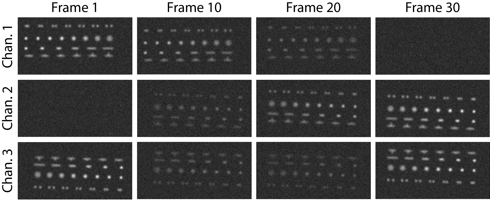
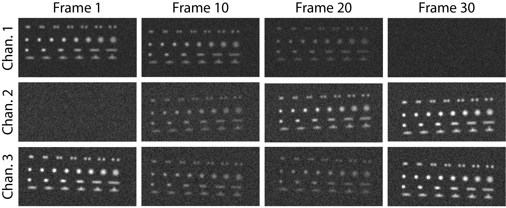
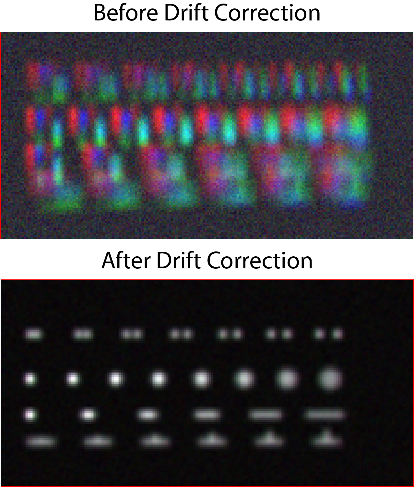
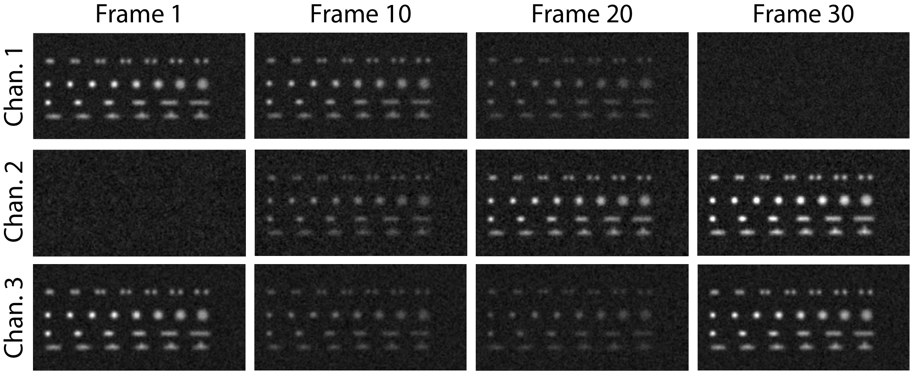
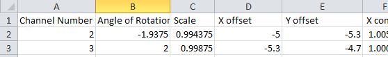
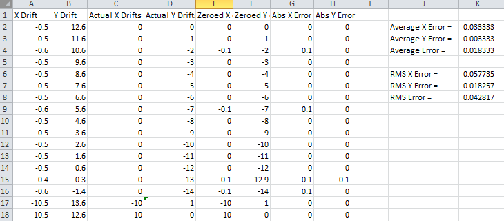
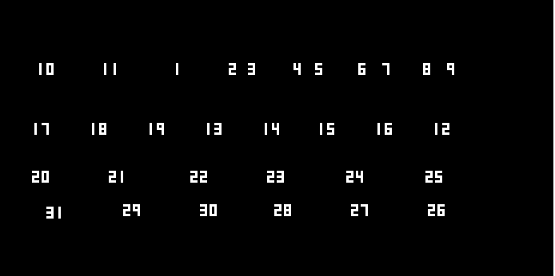
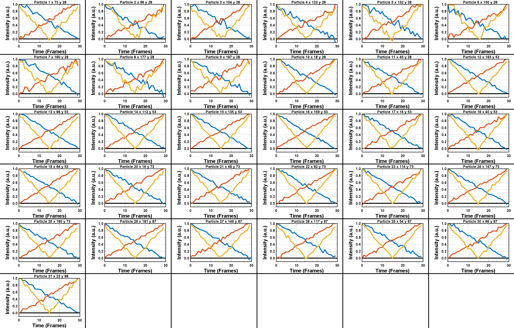
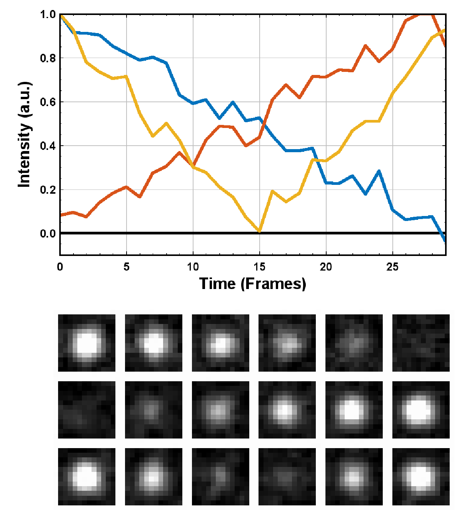

********************************************
Tutorial 2 - Generating Multi-Channel Traces
********************************************

Particles of interest are not always regular diffraction limited spots like in the previous example.
Some experiments involve the acquisition of two or more fluorophores to generate a multi-dimensional image stack containing multiple coloured channels. 
JIM provides the ability to analyse multi-channel images with functions to detect and select particles with arbitrary shapes for subsequent analysis. 

This tutorial analyses an artificially generated example designed to introduce new users to the abilities of JIM to generate traces from multi-channel data containing arbitrarily shaped objects. 
The artificial multi-channel image below contains the following shapes: diffraction spots pairs with increasing distance in between them, round particles with varying diameters, lines with varying length 
and thickness, and a T shaped object with length increasing on the stem. 

The data also contains three channels: The array in Channel 1 starts off bright then becomes dim, Channel 2 starts off dim then gradually becomes bright and Channel 3 starts bright, dims in the middle then brightens again. Channel 2 is horizontallty flipped and has an offset of 5 pixels in both x and y respective to Channel 1 plus a rotation of 0.05 radians to simulate slight misalignment between cameras in a real-life multi-camera system. Similiarly, Channel 3 is rotated approximately 180 degrees and slightly misaligned.

All channels have a directional drift downward at a rate of 1 pixel a frame and have a large jump at the 16th frame to simulate a stage drift over time which could happen during long imaging sessions. Through this tutorial, we will learn how JIM can deal with all of these challenges.
Below we a montage of the dataset to give a visual idea of what the data looks like. However, it is far more informative to open the data in ImageJ.

The file *Tutorial_2_MultiChannel_Multishape.tif* is located in the *Examples_To_Run\\2_MultiChannel_And_Shapes\\* of the JIM distribution. Users are strongly encouraged to open this file with a program like ImageJ to get a feel for what the data looks like. The file contains three channels all containing the array of shapes displayed above with 30 images in each channel. 

In the data folder there is a Mathematica file called *Jim_2_Channel_Example_Generator.nb* which was used to make this example in case the user wants to modify any aspect of the example data.

0) Import Parameters
====================

Often there will be standard parameters that a user would like to start from for analysing a type of data. Importing parameters gives the user a way to load those parameters.

The parameters used for this tutorial can be loaded by running this section and selecting the file *Examples_To_Run\\2_Multi_Channel_Multi_Shape\\Tutorial_2_Final_Parameters.csv*

The final parameters for this tutorial are also in a table `here <https://jim-immobilized-microscopy-suite.readthedocs.io/en/latest/tut_2_multi_channel.html#final-parameters>`_

1) Select Input File
====================

Running this section will open a window asking you to select the image file to analyse. Select the file *Tutorial_2_MultiChannel_Multishape.tif* is located in the *Examples_To_Run\\2_MultiChannel_And_Shapes\\* of the main JIM folder.

There is no ".ome" on the end of the tif file so we can set 

**Additional Extensions to Remove** = 0.

The data is all contained in a single file so we can set 

**Multiple Files Per Image Stack** = false;

This section also automatically finds the Jim_Programs folder by assuming that the Generate_Multi_Channel_Traces file is in the Jim distribution file. If you want to move the Generate_Multi_Channel_Traces file to another location, you will need to manually change the JIM variable to the pathname for the Jim_Programs folder.

Running this section will create a folder using the tiff image stack as the filename within the folder in which the image is located. All analysis files will be stored in this newly created folder. In our example, a folder called *Tutorial_2_MultiChannel_Multishape* will be created in the *2_MultiChannel_And_Shapes* folder.

Note that if you are rerunning this analysis, this section may give you a warning that the directory already exists. This is not a problem, you can just ignore it.

2) Organise Channels
====================

This section splits and orientates a multi-channel tiff stack into individual files for each channel to make it easier for downstream processing.

Set numberOfChannels equal to the number of channels that you have in your file. In this case:

**numberOfChannels** = 3

We know it is in order so we can **Disable Metadata**. We want to use the entire dataset (keeping in mind that negative numbers go from the end of the stack), so we set: 

**Stack Start Frame** = 1

**Stack End Frame** = -1

Next, we know that Channel 2 has been horizontally flipped and Channel 3 has been rotated by 180 degrees so we can reorientate both of these channels. Do do this, we set channels 2 and 3 to be transformed:

**Channels to transform** = 2 3

We don't wan't to vertical flip either of these two channels:

**Vertical Flip** = 0 0

We want to horizontally flip Channel 2 but not 3:

**Horizontal Flip** = 1 0

and we want to Rotate Channel 3 by 180 degrees and leave Channel 2 alone:

**Rotate** = 0 180

After running this section, three tiff stacks should be created in the analysis folder,Raw_Image_Stack_Channel_1, 2 and 3, corresponding to the three channels, which should be correctly orientated, although not precisely aligned: 

3) Align/Drift Correct
======================

The Channel alignment module consists of two parts: Drift correction and Channel Alignment.

Drift correction works by first creating a mean (mean projection) from a selection of image from the image stack defined from alignStartFrame to alignEndFrame, before individually aligning every frame to that mean. It is important to select a part of the image stack where the signal is observed in all channels simultaneously. In this example, we can choose any frame from the middle of the image stack, (i.e both channels are reasonably bright) so that the alignment runs successfully. For example, setting:

**iterations** = 1

**alignStartFrame** = 14

**alignEndFrame** = 14

**MaxShift** = 30

For this tutorial, we will assume that the alignment between channels is not known. There are two parameters that can help with calculating between channels, although neithr are relevent here. *Alignment Max Int.* is used to ignore overly bright particles like aggregates. This is not the case here so we set this to large values for all channels by setting:

**Alignment Max Int. ** = 65000 65000 65000

Note that we need to include one value for each channel.

The parameter *Alignment SNR detection Cutoff* causes the program to throw an error if the quality of alignment (calculated by corss correlation) falls below this cutoff. This is mostly useful for batch processing where this will stop the analysis if the alignment isn't found. In general leaving this value at the defualt is fine:

**Alignment SNR detection Cutoff** = 0.2

To calculate the best alignment parameters using JIM we also need to set

**manualAlignment** = false

The values of the other four manual alignment parameters are ignored when manualAlignment is set to false.

Running this section will give an initial and final alignment image of:

*Before and after drift correction and channel alignment of the dataset. Channel 1 is shown in Red, Channel 2 is shown in Green and Channel 3 is blue.*

We can also see the result of alignment by enabling the outputting the aligned stacks and viewing the resulting files:

*Montage of the aligned image stacks (Alignment_Channel_1_Aligned_Stack.tiff,Alignment_Channel_2_Aligned_Stack.tiff and Alignment_Channel_3_Aligned_Stack.tiff).*

(Optional) Calculating the Accuracy of Drift Correction
-------------------------------------------------------

Just as in Tutorial 1, this example is artificial data so we can calculate the accuracy of drift correction, however, in this example we can also look at the accuracy of the channel to channel alignment.

The alignment between channels can be found in the file *Alignment_Channel_To_Channel_Alignment.csv* in the analysis folder:

In comparison the actual values are:

.. list-table:: Actual Alignment Values
   :widths: 25 25 25 25 25
   :header-rows: 1

   * - Channel Number
     - Angle
     - Scale
     - X Offset
     - Y Offset
   * - 2
     - -2
     - 1
     - -5
     - -5
   * - 2
     - 2
     - 1
     - -5
     - -5

Comparing these values, we see that all values are within half a pixel. Regions of interest for traces are measured to the nearest pixel, so an alignment of this quality is sufficient.

To calculate the accuracy of the drift correction, drifts from the file *Alignment_Channel_1.csv* in the analysis folder need to be copied into the first two columns of the file *2_Drift_Accuracy_Calculator.xls* in the data file.
This should then give:

Calculating the drift in this data is much easier than the first tutorial as the signal to noise in the data is much better. The quality of drift correction is reflected in this with an average error of 0.02 pixels, which is ample for downstream analysis.

(Optional) Potential pitfalls of Channel Alignment
--------------------------------------------------

*Insufficient Signal in all channels for alignment*

If we try to use the first frame in the image as the initial mean we will run into problems as the image in Channel 2 is just noise. To see this, set:

**iterations** = 1

**alignStartFrame** = 1

**alignEndFrame** = 1

**MaxShift** = 30

**Alignment SNR detection Cutoff** = -1

**manualAlignment** = false;
 
Which gives an initial alignment image of 

Note that the green channel (Channel 2) is just noise. As a result it will align to a random position in the image which will ultimately give a nonsense alignment (In this case max angle =  0.57 max scale = 0.9982  x offset = -62 y offset = -14). There are sanity checks in the channel alignment program. As it has failed these, the output from the alignment program will indicate the following dialogue indicating that the alignment has failed:

When an alignment fails, the program assumes that the two channels are already aligned and just calculates final drifts for the stack. This is not the case in our example and so the final output displays a misaligned image:

In reality, very little signal is required to properly align channels. It could be achieved using the first two frames, where Channel 2 (green) has a virtually undetectable signal. To do this set:
iterations = 1 
alignStartFrame = 1 
alignEndFrame = 2
manualAlignment = false; 
This displays the following initial alignment image::

Despite the inability to see strong signal in Channel 2 (green), it was still sufficient to give the correct alignment (max angle =  -2.8 max scale = 0.9957  x offset = -5.4 y offset = -6.4 versus actual of max angle =-2.87 max scale = 1  x offset = -5 y offset = -5) and displays the aligned merged image:

It is also worth noting that if you manually align the channels then you only require signal in one channel to accurately drift correct. This can be shown by running the parameters:
iterations = 1;
alignStartFrame = 1;
alignEndFrame = 1;
manualAlignment = true; 
rotationAngle = -2.86;
scalingFactor = 1;
xoffset = -5;
yoffset = -5;
Which gives the final image:

Blurry Initial Alignment Image
If the sample has a large amount of drift (like this sample has), using a large number of frames will cause the initial partial mean projection used for alignment  to be smeary. This can lead to all further alignments to be less accurate.. For example, set:
iterations = 1 
alignStartFrame = 1 
alignEndFrame = 15
manualAlignment = false;  
This gives an initial partial mean image:

The smear from the image above meant that Channel 1 (red) and Channel 2 (green) are going to align to random parts of their respective smears. This changes what the transform is between the two aligned images, and most importantly it is no longer the correct transformation between the channels. As a result, the output alignment is wrong (y offset = -11.1 where it should be -5) and the final images end up being misaligned:

In summary, the number of frames used for the initial mean should be kept to as few frames as possible while the chosen frames should contain sufficient signal to properly align.
Jumps in Field of View
Misalignment can occur if you choose frames for the initial partial mean containing a jump where the field of view moves significantly between two frames (for example when the microscope stage has been bumped). In this case, the initial mean image will essentially have two copies of each feature in the image, one from averaging frames before the jump and the second copy from averaging frames after the jump. When the alignment runs, some frames will align to the pattern from before the jump and some will align to after the jump. The net result is that the end aligned image will appear to have ghosted duplicates of particles in it. We can observe this with our example as it contains a jump between the 16th and 17th frame. Setting:

iterations = 1
 
alignStartFrame = 14; 
alignEndFrame = 19; 
manualAlignment = false; 
Gives an initial mean image of 

Notice that there is a duplicate of each particle diagonally from each other. The magenta line links one pair of particles.The end result is that some particles align to one set of images and some align to the other giving a final alignment picture of:

The detected image transform will ultimately only be correct for one of the particle sets (which is yellow) while the other set is misaligned, appearing as red and green colours.
We recommend looking at the raw image to identify jump and avoid choosing an initial mean region where a jump occurs to avoid this misalignment problem. In principle, one frame may be chosen for alignment if the signal is strong enough. 

4) Make Sub-Average
===================

This section determines which portion of each channel’s image stack is used for detecting features for analysis. In this section, a range of frames from each stack can be selected (e.g. from frame 1-10 for Channel 1 and frame 20-30 for Channel 2) that make up the subaverage window. The larger the window, the more sensitive detection is for long-lived dim particles, but less sensitive it is for short-lived particles. This section creates a single image that combines the subaverage windows which is then used for detection. The particle positions detected from this image are then used across all channels (after being transformed to align to that channel) so that the same trace represents the same particle location in each channel. Traces for a detected position are generated for all channels across all frames in the image even if there is no fluorescent signal in that channel however in that case the trace will just show noise fluctuating around zero intensity. 

In this example we are detecting using both channels, so an object with signal in both channels is more likely to be detected than something that is only present in one channel, however, in most cases detection is robust enough that even particles that only exist in one channel will be detected. It is possible to detect using only one channel by setting the start and end frames of the unwanted channel to zero.

This section has three parameters:
useMaxProjection - determines whether the mean or the max of the window is used. Typically using the mean (useMaxProjection = false) is preferable as it averages the noisy background makes detection much easier, however, using the max projection is better if the data contains bright short-lived states. When the max projection is selected, the max for each channel is determined independently, with the final detection image given by the average of these maximum projections. 

detectionStartFrame - the list of start frames for each channel in order. Each channel value should be separated by a space. For Matlab, you need to enclose the list with single quotation marks, for Mathematica and Python you need double quote marks and for ImageJ you need none.
For example, to select from frame 1-10 for Channel 1 and frame 20-30 for Channel 2; you would write:
in Matlab: detectionStartFrame = ‘1 20’;
in Python and Mathematica: detectionStartFrame = “1 20”;
in ImageJ: detectionStartFrame : 1 20

detectionEndFrame is the list of end frames for each channel in order. For the same example:
In Matlab: detectionEndFrame = ‘10 30’;
In Python and Mathematica: detectionEndFrame = “10 30”;
In ImageJ: detectionEndFrame : 10 30
We chose these parameters because they were the regions of the two channels where the best signal to noise exists (the start of Channel 1 and the end of Channel 2). Running this section with these parameters yields:

The produced image revealed the particles with excellent signal to noise and to allow  accurate detection of particles of different shapes.
Note that if you set the detectionstartFrame parameter for a channel to 0 or negative, it will be set to one . Similarly, if the end value is larger than the number of frames in the image stack then the end value will automatically be set to the last frame of the image stack of that channel.
The easiest way to exclude a channel is to set the end frame to 0. In this case, channel will not contribute to the detection. 

5) Detect Particles
===================

The detect particles section of Generate_Multi_Channel_Traces is the same as for Generate_Single_Channel_Traces from Tutorial 1. The program has two parts. The first part is effectively a threshold which detects local increases in intensity above the surrounding background to define the mask as the ‘detected regions’. The second part filters these detected regions based on size and shape and other properties to isolate the desired particles.

To determine the correct value to use for the cutoff we first want to turn all of the filters off. 
To do all this set:
left = 0
right = 0
top = 0
bottom = 0
minCount = -1
maxCount = 10000
minEccentricity = -0.1; 
maxEccentricity = 1.1;
minLength = 0;
maxLength = 10000
maxDistFromLinear = 10000

In Matlab, you should adjust the display min and max to get good contrast on the detection image. In this case set:
displayMin = 0; 
displayMax = 2;

We then want to increase the cutoff until we are still detecting all particles with only a small amount of background. This occurs around when 
Cutoff = 0.4
Which looks like:

It is standard practice to exclude particles near the edge of the image, as a lot of cameras are prone to artifacts on their extreme edges. The left, right, top and bottom parameters can be set to the number of pixels on each respective edge to ignore (typically 25 is ample). In this case, the data has been generated quite close to the edge so we will overlook this to avoid throwing out our data. However, to demonstrate these filters in action, we can exclude some of the noise on the right, bottom and top regions of the image by setting:
left = 0;
right = 30;
top = 20;
bottom = 12;

Which then produces the image:

Note that all Blue to Pink coloured particles are selected while green to yellow particles are excluded. Using the image above, the rubbish around the edge of the image has been excluded and appears green.  

The next factor to consider in refining the selection is that some background particles are much smaller than our actual regions of interest. As a result we can set a minimum number of pixels that a region of interest needs to contain in order to be selected as a particle for downstream analysis. To do this we set:
minCount = 15
Which generates the image:

This has excluded the dimmest particle (second row, first column, turning green), but further cleaned up  every particle that appears as  background so on the whole it’s a net benefit. 
Having isolated all of the particles of interest, we can now impose additional filters to only select the particles that we are interested in.  

For example, if we are only interested in reasonably small particles then we can introduce a maximum number of pixels that a region needs to be smaller then. To do this we can set:
maxCount = 50 to yield the following image

Notice that the small particles in the top left corner are selected (coloured blue to pink) while all larger particles that have been excluded appearing  green to yellow.

We could also filter particles based on how round (or long) the object is. To explore this filter selection, we first want to remove the maximum region pixel count filter restriction by setting maxCount = 100000. 

The main measure of roundness is eccentricity of the best fit ellipse onto the particle. Eccentricity of the best fit ellipse goes from zero to one where zero represents a perfect circle through to one being a line. Use the Minimum to exclude round objects and use the maximum to exclude long, thin objects.
For example setting:
minEccentricity = -0.1
maxEccentricity = 0.3
Running with this setting should select for circular objects:

Circles or diffracted spots of different size (the second row) are selected as expected. Note that it is possible for random shapes that have symmetry (like the bottom right corner T shaped particles) to also be selected.

Alternatively we can select for long, thin objects by having a minimum eccentricity by setting:
minEccentricity = 0.55
maxEccentricity = 1.1
Which select all the tubes and gives 

We can apply a minimum absolute length (in pixels) of each region if we are concerned with the absolute length of particles rather than its relative length to width
First, turn eccentricity filters off by setting:

minEccentricity = -0.1
maxEccentricity = 1.1

Then set a minimum length of particles to 10 pixels by setting:

minlength = 10

Which gives the detection image of:

Note that the large circle (second row right) and the thick filaments (fourth row right) are selected at the same time by this filter but were excluded when using the eccentricity filters above.

Finally, if we are dealing with filaments, it is often helpful to set a maximum distance from a straight line fit that makes  filaments more refined by rejecting filaments that have irregular shape (such as branching) .
For example setting:
minLength = 0;
maxDistFromLinear = 3;
Displays the following image:

Note that both thick filaments (4th row right) and filaments with extrusions (5th row right) have been excluded by applying this filter.

A detailed explanation of these filter parameters can be found in the Detect_Particles.exe, but hopefully this section provides sufficient explanation to fulfil the majority of analytical needs.

For the rest of this section we will run with only basic filters. That is:
cutoff = 0.4
left = 0;
right = 30;
top = 20;
bottom = 12;
minCount = 15
maxCount = 10000
minEccentricity = -0.1; 
maxEccentricity = 1.1;
minLength = 0;
maxLength = 10000
maxDistFromLinear = 10000

So we can get traces for all the particles in our example.

6) Additional Backgrounds
=========================

This section takes the regions from the detect particles section and applies the channel alignment from Section 5 (Align Channels and Calculate Drifts) to calculate the positions of each particle in the other channels.

7) Expand Shapes
================

The next stage of analysis expands each detected region to make sure that all of the fluorescence from each particle is completely confined within the detected region. 

The area further surrounding the detected region is then used to estimate the background fluorescence surrounding the corresponding detected particle to be subtracted off to obtain the particles signal. Using the local background surrounding each spot, as opposed to one global background value for all particles, compensates for any unevenness in the illumination profile in the image or differences in focus of the field of view. The background area will excludes all other expanded detected regions as well as detected regions that was excluded by the filters. This is useful as it means that any bright spots in the background noise will not skew the background reading. 

The typical values used are:

**foregroundDist** = 4.1; 

**backInnerDist** = 4.1;

**backOuterDist** = 20;

Details of these parameters can be found `here<https://jim-immobilized-microscopy-suite.readthedocs.io/en/latest/begin_here_generate_traces.html#expand-regions>`_.

Running this section gives:

.. image:: tut_2_Expanded.PNG
  :width: 300
  :alt: Exanded Regions

*Expanded shapes for each region. The detection image is shown in red, the expanded detect regions are in green and the background regions are shown in blue. The combination of red and green gives yellow, showing that the fluorescence for each particle is well contained within each green region.*

These default values work for the vast majority of cases. The key points to check in the output image is that all of the flourescence (yellow) is contained in the green areas, and that the background area is sufficient that there is a reasonable blue area for every particle. The only times this is likely to not be the case is if you have a mix of very bright and dim particles, if the microscope has a pixel size much bigger, or smaller, then Nyquist sampling, or if the sample is really crowded.

8) Calculate Traces
===================

The final step of generating traces produces a table for each channel containing the intensity of each particle over time. Drift is accounted for over the entire image stack and the background intensity is subtracted from the intensity of each detected region. Each detected region has its total intensity measured in each frame, over time. 
Running this section creates the files Channel_1_Flourescent_Intensities.csv and Channel_2_Flourescent_Intensities.csv in the Jim_2_Channel_Example folder. Opening Channel_1_Flourescent_Intensities.csv in Microsoft Excel (or similar) will show the fluorescent intensities for Channel 1:

Similarly, opening Channel_2_Flourescent_Intensities.csv shows the fluorescent intensities for Channel 2:

Each row in Channel_1_Flourescent_Intensities.csv corresponds to the same particle in the same row as Channel_2_Flourescent_Intensities.csv. 

If we want information about any particle, we can open the file Detected_Filtered_Measurements.csv which gives information on the shape and position of each particle. It looks like:

Again, every row in this file corresponds to the same particle in the same row in Channel_1_Flourescent_Intensities.csv and Channel_2_Flourescent_Intensities.csv.

Setting verboseOutput = true creates an additional output for each channel (Channel_1_Verbose_Traces.csv, Channel_2_Verbose_Traces.csv etc. in the Jim_2_Channel_Example folder) which gives stats for each intensity such as max, min, mean and median intensities for background and foreground etc for each frame.  Full details of this file can be found in the Calculate_Traces.exe program documentation. This can be helpful for troubleshooting. or the most part, is not needed and the resulting file can be very large if the image stack has a lot of frames and a lot of regions of interest. Therefore, we will leave verboseOutput = false by default. 

Running this section also generate a file that saves all the variables used to generate these traces. This file is called Trace_Generation_Variables.csv and is located in the Jim_2_Channel_Example folder.

9) View Traces
==============

Just as with Generate_Single_Channel_Traces we can view the traces that we’ve just generated in this section. Running the next section will display two figures. The first image shows the particle location and numbers for each detected region.  This makes it easy to correlate which trace corresponds to which particle. The first figure should look like this:

The second figure displays a page containing an array traces. The variable pageNumber dictates which page of traces to display. For example, setting this variable to pageNumber = 1 will print traces 1 to 36 which should look like:

*Montage of measured traces. In each trace, the blue line corresponds to signal from Channel 1, the orange line corresponds to Channel 2 and the Yellow to Channel 3*
 

10) Export Trace
================

*The extracted trace for Particle 9. The montage of the images of the particle throughout the experiment is shown below the trace. Each row of the montage corresponds to Channels 1,2 and 3 respectively. Each column, is the mean of the 5 images in the corresponding range in the plot above.*

Congratulations. You have successfully completed this module and should be familiar in using JIM  how to generate traces for one and two coloured channel data. It is now time to start  using these traces to answer your scientific aims. JIM includes many of our commonly used analysis modules such as determining intensity of a fluorophore by photobleaching and measuring binding affinities. We have tutorials for each of these modules to illustrate their applications. If you want to use traces to do something that is outside the scope of the included files, we also include templates to help set you on the road to writing your own software.

Final Parameters
===================
The final parameters used for this tutorial can be loaded from the file *Tutorial_2_Final_Parameters.csv* in the dataset folder. The parameters are :

.. csv-table:: Final Tutorial 2 Parameters
   :file: Tutorial_2_Final_Parameters.csv
   :widths: 30, 30
   :header-rows: 0
